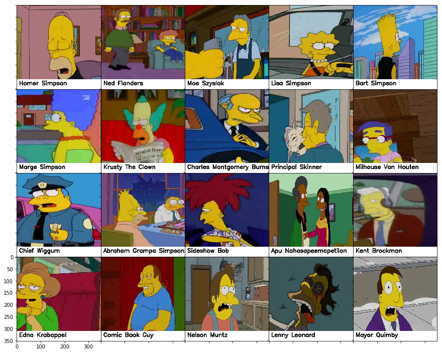

# Классификация персонажей Симпсонов с помощью CNN

## 🎯 Задача
Классификация изображений персонажей мультсериала "Симпсоны" с использованием сверточной нейронной сети (CNN).

## 📊 Метрика качества
**F1-Score: 98%**

## 📁 Датасет

## Следующие задачи:
1. TL ResNet18
2. TTA

